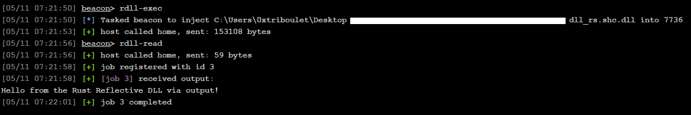

# rdll-rs

A Rust DLL template project that integrates [pe2shc](https://github.com/hasherezade/pe_to_shellcode) to facilitate the development of [Reflective DLLs](https://github.com/stephenfewer/ReflectiveDLLInjection). The template presently only supports 64-bit DLL development in most contexts, though with a few tweaks it should support 32-bit.

## Overview

rdll-rs is a Rust template that can be compiled as both a dynamic-link library (DLL), a regular executable, or a Reflective DLL. It provides an example of how to create Windows DLLs using Rust, including proper exports and Windows API integration.

This project is broken down into "main" branches `master` and `master-legacy`.

- `master` is intended for use with modern prepend loaders.
- `master-legacy` retains the necessary symbols for compatibility with stomp-style reflective loaders.

## Features

- Dual compilation modes (DLL and executable)
- Windows API integration through FFI
- Example exported functions
- DLL lifecycle management

## Project Structure

- `dll/src/lib.rs` - Library entry point
- `dll/c_src/c_entry.c` - Entry point for C code via FFI
- `exe/src/main.rs` - Executable implementation
- `build-deps/pe_to_shellcode` - Post-build stomp reflective loader
- Supporting Rust source files

## Building

To build the project, use Cargo:
```bash
cargo build
```
Or to build in release:
```bash
cargo build --release
```
Or to build a Reflective DLL:
```bash
cargo run --bin xtask --release
```

## Usage

The project can be used in thee ways:

1. As a DLL (**dll-rs.dll**):
    - Build in release mode to generate the DLL
    - The DLL exports a `DllMain` function and example functionality
2. As an executable (**debug-executable.exe**):
    - Run in debug mode to test DLL functionality without DLL debugging gymnastics
    - Running in release mode will display a warning message
    - **NOTE: For maximum compatability with this template, all functionality should be called from `dll_main` in `dll/src/lib.rs`**
3. As a Reflective DLL (**dll_rs.shc.dll**) using [@hasherezade's](https://github.com/hasherezade) [pe_to_shellcode](https://github.com/hasherezade/pe_to_shellcode)
    - Resolve submodules with `git submodule update --init --recursive`
    - `cd .\build-deps\pe_to_shellcode\`
    - `cmake .`
    - `cmake --build . --config Release`
    - `cd ..\..`
    - `cargo run --bin xtask --release`
    - Use your Reflective DLL in `target/release/dll_rs.shc.dll`
    - **NOTE: If the build process above is too complicated/broken for your taste, simply placing the [`pe2shc.exe`](https://github.com/hasherezade/pe_to_shellcode/releases/download/v1.2/pe2shc.exe) executable in the proper folder structure (`build-deps/pe_to_shellcode/pe2shc/Release/pe2shc.exe`) will work.**

## Getting Reflective DLL Output to Beacon Console
This template includes a `write_output` function which allows for output via named pipes to the Beacon console (in a very hacky way).
This works by loading the `rdll-rs.cna` which registers two commands: `rdll-exec` and `rdll-read`.
- `rdll-exec` stomps the pipe name specified in the `.cna` into the `dll_rs.shc.dll`, then injects the DLL via the `bdllinject` aggressor function.
- `rdll-read` uses `CommandBuilder` to build a custom task to read from the pipe and output the contents to the Beacon console.
- **NOTE: `write_output` is **BLOCKING** so it should only be used to write output to the Beacon console all at once (ie once your intended functionality is entirely complete).**



## Using Other Reflective Loaders
The `master` branch of this repository abandoned compatability with stomp loaders in favor of more generic prepend-style (sRDI) reflective loaders. For stomp-style support see the `master-legacy` branch. Some implementations of reflective loaders obfuscate the DLL. This can be helpful in some contexts but applying the obfuscation on the DLL before execution of the `.cna` results in a failure to stomp the appropriate pipe name into the DLL, breaking `write_output` functionality. To mitigate the risk of this, it's recommended that a manual stomp step be applied before the reflective loader is applied to the DLL. An example workflow that uses a PowerShell one-liner is below:
- `cargo build --release`
- `cd target/release`
- ```$path = "dll_rs.dll"; $bytes = [System.IO.File]::ReadAllBytes($path); $search = [System.Text.Encoding]::ASCII.GetBytes("RDLL_PIPE_NAME_NO_CHANGE_PLS"); $replace = [System.Text.Encoding]::ASCII.GetBytes("macrohard_updates`0".PadRight($search.Length, "`0")); for ($i = 0; $i -le $bytes.Length - $search.Length; $i++) { $match = $true; for ($j = 0; $j -lt $search.Length; $j++) { if ($bytes[$i + $j] -ne $search[$j]) { $match = $false; break } } if ($match) { $replace.CopyTo($bytes, $i); break } }; [System.IO.File]::WriteAllBytes($path, $bytes)```
   - **Note that `macrohard_updates` should match the pipe name in the `.cna` and has the same length limitation (28-bytes).**
- `donut --input:dll_rs.dll -o dll_rs.shc.dll`

## I don't want to learn Rust
I encourage you to try it sometime. However, to support the integration of C code a [Foreign Function Interface (FFI)](https://doc.rust-lang.org/nomicon/ffi.html) entry point (`dll/c_src/c_entry.c`) has been added to the template to allow you to call into C code from Rust.


If you want to add more `.c` files, be sure to add them to the `dll/c_src` directory because that's the intended convention, and define desired FFI functions in `dll/ffi.rs` if you want to call them from Rust. The build script `dll/build.rs` builds all `.c` files in the `c_src` directory into a single
static library (`c_code`) that is linked into the Rust DLL.

## Technical Details

- Uses `cdylib` and `rlib` crate types
- Implements Windows API bindings
- Provides internal FFI declarations for Windows types
- Includes DLL entry point handling
- Remember: For maximum compatability with this template, all functionality should be called from `dll_main` in `dll/src/lib.rs`
- Supports the command-line ergonomics of the `shinject` in your [favorite C2 Framework](https://www.cobaltstrike.com/).

## Comments
This template is significantly more useful than most existing Reflective DLL templates in C/C++ because it provides an organic platform from which third-party libraries can be readily used. This is thanks to Rust's [Cargo](https://github.com/rust-lang/cargo) which allows for easily sharable libraries. 
For example, if you were looking for a method of stack spoofing from inside a Reflective DLL in C/C++ you would most likely be stuck implementing that yourself from your preferred template. However, using Cargo, you can quickly add a library like [uwd](https://crates.io/crates/uwd) to 
get access to that capability without any of the overhead or additional Git submodule shenanigans that come with setting that up in a C/C++ repository. The entire [Crates](https://crates.io/) ecosystem is now at your fingertips.

## Requirements

- Rust 2024 edition
- Windows operating system
- Cargo build system
- Cmake > 3.0

## Licensing

- MIT or Apache 2.0