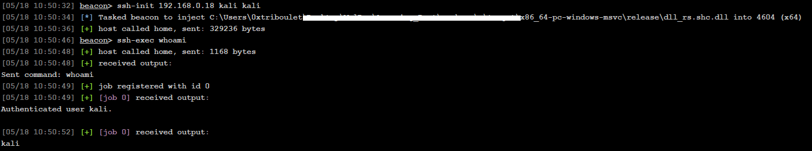

# rssh-rs

A Rust DLL project that integrates [pe2shc](https://github.com/hasherezade/pe_to_shellcode) to facilitate the development of [Reflective DLLs](https://github.com/stephenfewer/ReflectiveDLLInjection). The project presently only supports 64-bit DLL development in most contexts, though with a few tweaks it should support 32-bit.

## Overview

`rssh-rs` Is an ssh client that connects to the specified target IP address via username and password with the `ssh-init` command from a Beacon session. Commands can then be sent to the session with the `ssh-exec` command.


## Features

- `rdll-rs.cna` Which stomps in user arguments into the appropriate places for use by the DLL.
- `ssh-init` the command that initializes the SSH session with the server and setups the named pipes that will be used for input/output from the DLL.
- `ssh-exec` which can be used to pass commands to the SSH session via Beacon Object File (BOF).

## Project Structure

- `dll/src/lib.rs` - Library entry point
- `exe/src/main.rs` - Executable implementation
- `build-deps/pe_to_shellcode` - Post-build stomp reflective loader
- Supporting Rust source files

## Building

To build the project, use Cargo:
```bash
cargo build
```
Or to build in release:
```bash
cargo build --release
```
Or to build a Reflective DLL:
```bash
cargo run --bin xtask --release
```

## Usage

For use from Cobalt Strike (**without building from source**), these steps should be followed:
1. `git clone https://github.com/0xTriboulet/rssh-rs`
2. From the Script Manager, load `rdll-rs.cna`
3. Run `ssh-init <ssh server ip> <username> <password> <optional: pid>`
4. Run commands with `ssh-exec <command>`

## Building from Source
1. `rssh-rs` (**dll_rs.shc.dll**) is intended to be built with [@hasherezade's](https://github.com/hasherezade) [pe_to_shellcode](https://github.com/hasherezade/pe_to_shellcode)
    - Resolve submodules with `git submodule update --init --recursive`
    - `cd .\build-deps\pe_to_shellcode\`
    - `cmake .`
    - `cmake --build . --config Release`
    - `cd ..\..`
    - `cargo run --bin xtask --release`
    - Use your Reflective DLL in `target/release/dll_rs.shc.dll` via `rdll-rs.cna`
    - **NOTE: If the build process above is too complicated/broken for your taste, simply placing the [`pe2shc.exe`](https://github.com/hasherezade/pe_to_shellcode/releases/download/v1.2/pe2shc.exe) executable in the proper folder structure (`build-deps/pe_to_shellcode/pe2shc/Release/pe2shc.exe`) will work.**
2.  Build the BOF project included in the `bof-vs` directory with Visual Studio. Two pre-compiled versions of this BOF is included in this repository as `bof-vs/x64/Release/bof.x64.o.orig` and `bof-vs/x64/Release/bof.x64.o`. `bof.x64.o.orig` can be used to restore the BOF to its original condition without having to use Visual Studio.
3.  Load `rdll-rs.cna` from the Beacon console.
4.  Use the `ssh-init` command with the appropriate commands to connect to the SSH server of your choosing.
5.  For more comprehensive documentation regarding development and manipulation of source code, see [rdll-rs](https://github.com/0xTriboulet/rdll-rs).


## Getting Reflective DLL Output to Beacon Console
`rdll-rs.cna` contains a `ssh-read` function that is automatically called when `ssh-exec` is used. There's a possibility that this job will timeout before output from the SSH server is sent back. If this is the case, the command will be retreived from the named pipe on the next issued command from the Beacon console.

## Using Other Reflective Loaders
Some implementations of reflective loaders obfuscate the DLL. This can be helpful in some contexts but applying the obfuscation on the DLL before execution of the `.cna` results in a failure to stomp the appropriate pipe names, username, password, and target IP address into the DLL, breaking the functionality of this DLL. To mitigate the risk of this, it's recommended that a manual stomp step be applied before an alternative reflective loader is applied to the DLL. An example workflow that uses a PowerShell one-liner is below:
- `cargo build --release`
- `cd target/release`
- ```$path = "dll_rs.dll"; $bytes = [System.IO.File]::ReadAllBytes($path); $search = [System.Text.Encoding]::ASCII.GetBytes("OUTPUT_PIPE_NAME_NO_CHANGE_PLS"); $replace = [System.Text.Encoding]::ASCII.GetBytes("macrohard_updates`0".PadRight($search.Length, "`0")); for ($i = 0; $i -le $bytes.Length - $search.Length; $i++) { $match = $true; for ($j = 0; $j -lt $search.Length; $j++) { if ($bytes[$i + $j] -ne $search[$j]) { $match = $false; break } } if ($match) { $replace.CopyTo($bytes, $i); break } }; [System.IO.File]::WriteAllBytes($path, $bytes)```
   - **Note that `macrohard_updates` should match the pipe name in the `.cna` and has the same length limitation (28-bytes).**
- `donut --input:dll_rs.dll -o dll_rs.shc.dll`
- **Note that *ALL* `stomp_me` variables in the `.cna` must be manually handled this way**

## I don't want to learn Rust
I encourage you to try it sometime. However, this repsitory does not require that you learn Rust in order to use the DLL. Prebuilt binaries are included in the appropriate directories in this repository.

## Technical Details

- User arguments passed in to `ssh-init` are stomped into the DLL.The DLL then initializes two named pipes, one for input and one for output. It then authenticates to the specified SSH server using the credentials provided and waits for user commands.
- `ssh-exec` fires a BOF that writes to the pipe that the DLL is listening on. When the DLL receives this input, it forwards the command to the SSH server.
- Supports the command-line ergonomics of in your [favorite C2 Framework](https://www.cobaltstrike.com/).

## Requirements

- Rust 2024 edition
- Windows operating system
- Visual Studio 2022
- Cargo build system
- Cmake > 3.0

## Licensing

- MIT or Apache 2.0
- A copy of [bof-vs](https://github.com/Cobalt-Strike/bof-vs) is included in this repository for ease of rebuilding from source. That code is redistrubuted under Apache 2.0.