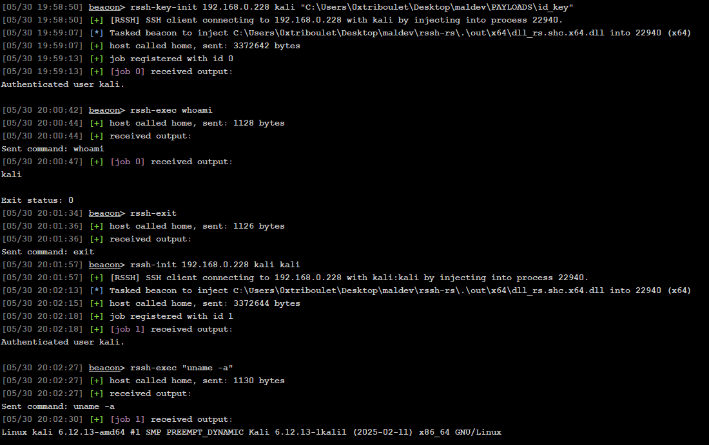

# rssh-rs

A Rust DLL project that integrates [pe2shc](https://github.com/hasherezade/pe_to_shellcode) to facilitate the development of [Reflective DLLs](https://github.com/stephenfewer/ReflectiveDLLInjection). The project presently only supports 64-bit DLL development in most contexts, though with a few tweaks it should support 32-bit.

## Overview

`rssh-rs` Is an ssh client that connects to the specified target IP address via username and password with the `ssh-init` command from a Beacon session. Commands can then be sent to the session with the `ssh-exec` command.


## Features

- `rdll-rs.cna` Which stomps in user arguments into the appropriate places for use by the DLL.
- `rssh-init` the command that initializes the SSH session with the server using credentials and sets up the named pipes that will be used for input/output from the DLL.
- `rssh-key-init` the command that initializes the SSH session with the server using a private key and sets up the named pipes that will be used for input/output from the DLL.
- `rssh-exec` which can be used to pass commands to the SSH session via Beacon Object File (BOF).
- `rssh-exit` which can be used to exit the SSH session cleanly.
- 
## Project Structure

- `dll/src/lib.rs` - Library entry point
- `exe/src/main.rs` - Executable implementation
- `bins/` - Pre-built binaries for use by the `.cna`
- `out/` - Binaries with stomped-in values (You want to use these for post-processing/obfuscation)

## Usage

For use from Cobalt Strike (**without building from source**), these steps should be followed:
1. `git clone https://github.com/0xTriboulet/rssh-rs`
2. From the Script Manager, load `rdll-rs.cna`
3. Run `ssh-init <ssh server ip> <username> <password> <optional: pid>`
4. Run commands with `ssh-exec <command>`

## Building from Source

1. `rssh-rs` (**dll_rs.shc.dll**) is intended to be built with [@hasherezade's](https://github.com/hasherezade) [pe_to_shellcode](https://github.com/hasherezade/pe_to_shellcode). Be sure to download the `pe2shc.exe` binary and add it to your system path before building from source.

2. Once the above is complete, you can build with Cargo:

    Debug build:
    ```bash
    cargo build
    ```
    Or to build in release:
    ```bash
    cargo build --release
    ```
    Or to build a Reflective DLL using pe2shc:
    ```bash
    cargo run --bin xtask --release
    ```

3.  Load `rdll-rs.cna` from the Beacon console.
4.  Use the `rssh-init` or `rssh-key-init` commands with the appropriate arguments to connect to the SSH server of your choosing.
5.  For more comprehensive documentation regarding the development and manipulation of source code, see [rdll-rs](https://github.com/0xTriboulet/rdll-rs).


## Getting Reflective DLL Output to Beacon Console
`rdll-rs.cna` contains a `rssh-read` function that is automatically called when `rssh-exec` is used. There's a possibility that this job will timeout before output from the SSH server is sent back. If this is the case, the output will be retreived from the named pipe on the next issued command from the Beacon console.

## Using Other Reflective Loaders
For proof-of-concept functionality, `rssh-rs` applies `pe2shc`'s reflective loader to `dll_rs.dll` -> `dll_rs.shc.x64.dll`. However, one of the really cool capabilities of `pe2shc` is that the output PE retains all functionality of the original. This means that you can apply your own "obfuscation"-enabled reflective loader on-top without any negative effects at run time.

## I don't want to learn Rust
I encourage you to try it sometime. However, this repsitory does not require that you learn Rust to use the DLL. Prebuilt binaries are included in the appropriate directories in this repository.

## Technical Details

- User arguments passed in to `rssh-init` are stomped into the DLL.The DLL then initializes two named pipes, one for input and one for output. It then authenticates to the specified SSH server using the credentials provided and waits for user commands.
- `rssh-exec` fires a BOF that writes to the pipe that the DLL is listening on. When the DLL receives this input, it forwards the command to the SSH server.
- Supports the command-line ergonomics of in your [favorite C2 Framework](https://www.cobaltstrike.com/).

## Requirements

- Rust 2024 edition
- Windows operating system
- Visual Studio 2022
- Cargo build system

## Licensing

- MIT or Apache 2.0